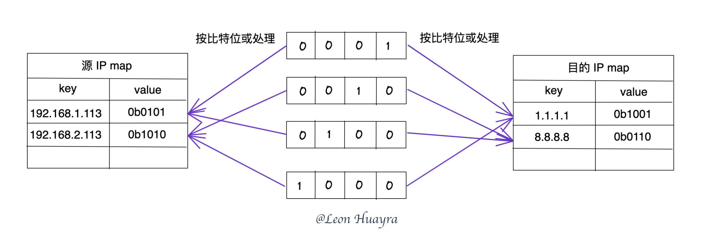
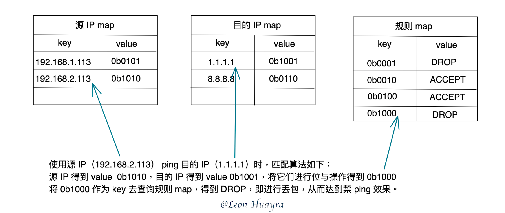

# demo for 「eBPF 技术实践：高性能 ACL」

在阅读了字节跳动发出的公众号文章 [eBPF 技术实践：高性能 ACL](https://mp.weixin.qq.com/s/25mhUrNhF3HW8H6-ES7waA) 后，对其中提出的 **O(1)** 匹配算法颇为佩服；但初始看了好几遍，都没看懂这个匹配算法。如今看懂后，迫不及待地写了这个小 demo 来验证该算法。

> 源代码：[github.com/Asphaltt/learn-by-example/ebpf-acl](https://github.com/Asphaltt/learn-by-example/tree/main/ebpf-acl)

## 算法解读

以本 demo 为例，在 iptables 中禁止对 1.1.1.1 这个 IP 进行 ping。则需要使用如下 iptables 规则：

```bash
iptables -I OUTPUT -m bpf --object-pinned /sys/fs/bpf/ipt_acl -j DROP
```

> 该 iptables 规则的理解请参考： [该如此玩转 iptables-bpf](https://asphaltt.github.io/post/iptables-bpf/)

对其中的 eBPF 程序使用大小为 4 的 bitmap 进行解读。

### iptables 规则映射

在该算法中，每条规则的 ID 使用一个比特来表示。则第一条规则的 ID 如下：


对于源 IP，使用一个 eBPF map 保存源 IP 到规则 ID 的映射关系；如果多条规则使用到同一个源 IP，则将这些规则的 ID 进行位或操作、并保存到 eBPF map 中。对于目的 IP 进行类似的处理。

对于 TCP、UDP、ICMP 等网络协议的处理，可采用类似的处理方式。在本 demo 中忽略对网络协议的映射处理。

最后，使用一个 eBPF map 保存规则 ID 到规则动作的映射关系。

匹配步骤如下：
1. 使用网络包中的源 IP 作为 key，到源 IP map 中查询得到结果 result1
2. 使用网络包中的目的 IP 作为 key，到目的 IP map 中查询得到结果 result2
3. 将它们按位与操作，result1&result2 得到结果 result；此处注意，如果 result 中有多个比特为 1，则取最左侧比特为 1 作为最终结果，表示拿到优先级最高的那一条规则（一个比特位代表一条规则）
4. 将 result 作为 key，到规则 map 中查询得到最终结果

### 规则映射例子

假如有 4 条 iptables 规则：

```bash
iptables -A OUTPUT -s 192.168.1.113 -d 1.1.1.1 -p icmp -j DROP    # rule1 => 0b0001
iptables -A OUTPUT -s 192.168.2.113 -d 8.8.8.8 -p icmp -j ACCEPT  # rule2 => 0b0010
iptables -A OUTPUT -s 192.168.1.113 -d 8.8.8.8 -p icmp -j ACCEPT  # rule3 => 0b0100
iptables -A OUTPUT -s 192.168.2.113 -d 1.1.1.1 -p icmp -j DROP    # rule4 => 0b1000
```

对 iptables 规则进行预处理：



在 IP 为 192.168.2.113 的容器中 ping 1.1.1.1 的匹配过程如下：



## demo 效果

```bash
# ping -c4 -W1 1.1.1.1
PING 1.1.1.1 (1.1.1.1) 56(84) bytes of data.
64 bytes from 1.1.1.1: icmp_seq=1 ttl=59 time=0.910 ms
64 bytes from 1.1.1.1: icmp_seq=2 ttl=59 time=0.783 ms
64 bytes from 1.1.1.1: icmp_seq=3 ttl=59 time=0.936 ms
64 bytes from 1.1.1.1: icmp_seq=4 ttl=59 time=0.787 ms

--- 1.1.1.1 ping statistics ---
4 packets transmitted, 4 received, 0% packet loss, time 3012ms
rtt min/avg/max/mdev = 0.783/0.854/0.936/0.069 ms

# make
clang -I./ebpf/headers -O2 -g -target bpf -c ebpf/acl.c  -o iptables-ebpf-acl.elf
go build -v -trimpath -o iptables-ebpf-acl main.go

# make setup
bpftool prog load iptables-ebpf-acl.elf /sys/fs/bpf/ipt_acl
libbpf: elf: skipping unrecognized data section(6) .rodata.str1.1
iptables -I OUTPUT -m bpf --object-pinned /sys/fs/bpf/ipt_acl -j DROP

# ./iptables-ebpf-acl -s 149.28.xxx.yyy -d 1.1.1.1
2022/03/30 14:41:31 Found maps: map[filter_daddrs:55 filter_rules:56 filter_saddrs:54]
2022/03/30 14:41:31 149.28.xxx.yyy -> 1.1.1.1 is disallowed to be pinged

# ping -c4 -W1 1.1.1.1
PING 1.1.1.1 (1.1.1.1) 56(84) bytes of data.

--- 1.1.1.1 ping statistics ---
4 packets transmitted, 0 received, 100% packet loss, time 3075ms

# make clean
rm -f iptables-ebpf-acl.elf
rm -f iptables-ebpf-acl
iptables -D OUTPUT -m bpf --object-pinned /sys/fs/bpf/ipt_acl -j DROP
rm -f /sys/fs/bpf/ipt_acl

# ping -c4 -W1 1.1.1.1
PING 1.1.1.1 (1.1.1.1) 56(84) bytes of data.
64 bytes from 1.1.1.1: icmp_seq=1 ttl=59 time=1.64 ms
64 bytes from 1.1.1.1: icmp_seq=2 ttl=59 time=0.841 ms
64 bytes from 1.1.1.1: icmp_seq=3 ttl=59 time=0.906 ms
64 bytes from 1.1.1.1: icmp_seq=4 ttl=59 time=3.26 ms

--- 1.1.1.1 ping statistics ---
4 packets transmitted, 4 received, 0% packet loss, time 3021ms
rtt min/avg/max/mdev = 0.841/1.661/3.257/0.973 ms
```

## demo 系统环境

```bash
# lsb_release -a
No LSB modules are available.
Distributor ID: Ubuntu
Description:    Ubuntu 21.10
Release:        21.10
Codename:       impish

# uname -a
Linux vultr 5.13.0-28-generic #31-Ubuntu SMP Thu Jan 13 17:41:06 UTC 2022 x86_64 x86_64 x86_64 GNU/Linux
```

## 小结

诚如该公众号文章所说，该匹配算法并不局限于 iptables xt_bpf，而能够适用于任何使用 eBPF 匹配网络包的场景，譬如 XDP、TC，甚至是 Open vSwitch 中基于 eBPF 的扩展。

看似完美的 **O(1)** 匹配算法，却有一个*致命*的缺陷：保存规则的 bitmap 有长度限制，在使用的时候就需要预估好 bitmap 的大小且无法动态扩容。比如，保存 1024 条规则需要使用 128 字节大小的 bitmap。然而，看似*致命*，但大部分场景使用的规则数量都不会超过 100 条。
