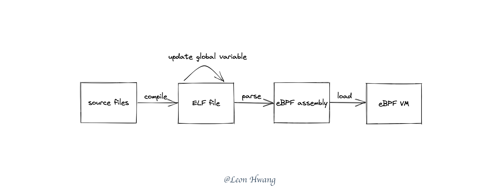
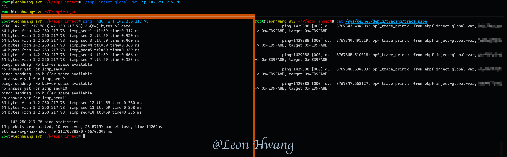
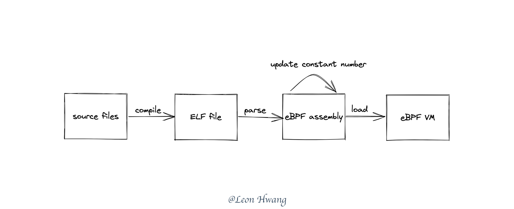
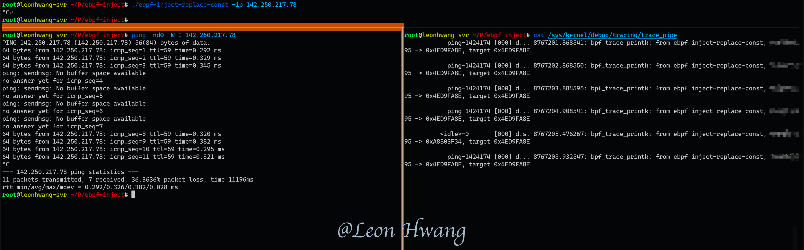

# 为 eBPF 程序注入黑魔法

在 Kubernetes 集群环境下，如果跨节点的 Pod 需要组成多个 VPC 网络，使用 eBPF 的时候，该如何在 CNI 层面动态地为每个 Pod 分配 VXLAN VNI 或者 VLAN ID 呢？

一个简单可行的办法是，每次 CNI 为 Pod 挂载 eBPF 程序的时候，都去重新编译 eBPF 程序。这样一来，就可以动态地向 eBPF 程序注入 VXLAN VNI 或者 VLAN ID 了。

可是，这办法会导致每次都需要生成新的 eBPF 源代码、运行 `clang` 命令行去编译。由此可知，CNI 需要为每个 Pod 都进行文件操作、命令行执行；这些处理都会带来性能损耗、时间损耗、更低的稳定性。

有没有像 **CO-RE** 那样只需要一次编译、还可以动态注入 VXLAN VNI 或者 VLAN ID 的办法呢？

> 下面的试验以 ping 为例，动态注入 VXLAN VNI 或者 VLAN ID 也可以采用同样的办法。

## 全局变量法

全局变量的办法，指的是 eBPF 程序里使用全局变量，然后使用工具去变更 eBPF 程序 ELF 文件里的全局变量。

在 Linux 系统里，`clang` 编译 eBPF 程序得到的文件格式是 ELF。而在 ELF 文件里，使用工具能够变更其中的全局变量的值。参考 [On self-modifying executables in Go](https://muscar.eu/self-modify.html)。

原理如下图：



以下为试验代码。

```C
__u32 target_addr = 0xFEDCBA98;

SEC("egress")
int filter_out(void *skb) {
  struct iphdr iph;

  if (bpf_skb_load_bytes_relative(skb, 0, &iph, sizeof(iph),
                                  BPF_HDR_START_NET) < 0)
    return TC_ACT_OK;

  if (iph.protocol != IPPROTO_ICMP) return TC_ACT_OK;

  bpf_printk("from ebpf inject-global-var, 0x%08X -> 0x%08X, target 0x%08X\n",
             iph.saddr, iph.daddr, target_addr);

  if (iph.daddr == target_addr) return TC_ACT_SHOT;

  return TC_ACT_OK;
}
```

可以通过以下方式修改 ELF 文件里的 `target_addr` 变量。

```go
func (e *entry) put(data []byte, val uint32, bo binary.ByteOrder) {
	data = data[e.off:]
	switch e.val.(type) {
	case uint8:
		data[0] = byte(val)
	case uint16:
		bo.PutUint16(data[:2], uint16(val))
	case uint32:
		bo.PutUint32(data[:4], val)
	case uint64:
		bo.PutUint64(data[:8], uint64(val))
	}
}

func getEntry(f *elf.File, name string) (*entry, error) {
	syms := must(f.Symbols())
	for _, s := range syms {
		if s.Name == name {
			sect := f.Sections[s.Section]
			bs, _ := sect.Data()
			varOff := s.Value - sect.Addr

			var e entry
			e.off = sect.Offset + varOff
			e.get(bs[varOff:], s.Size, f.ByteOrder)
			return &e, nil
		}
	}
	return nil, fmt.Errorf("can't find symbol '%s'", name)
}
```

完整代码请参考：[ebpf-inject-global-var](https://github.com/Asphaltt/learn-by-example/tree/main/ebpf-inject)

效果如下：



## 常量替换法

常量替换的办法，指的是在 eBPF 程序里使用某个特定的常量当作占位符，然后在 Go 程序里解析 eBPF 程序的 ELF 文件后得到 eBPF 汇编之后，将 eBPF 汇编里的那个特定的常量替换为一个新的值。

相比 **动态变更全局变量** 办法，该办法能够规避因全局变量而带来的内核版本不兼容性（更严格的 eBPF verifier 可能会禁止使用全局变量）。但是对于一个工程而言，该办法在工程上的实践并不友好。

原理如下图：



以下为试验代码：

```c
#define target_addr 0xFEDCBA98

SEC("egress")
int filter_out(void *skb) {
  struct iphdr iph;

  if (bpf_skb_load_bytes_relative(skb, 0, &iph, sizeof(iph),
                                  BPF_HDR_START_NET) < 0)
    return TC_ACT_OK;

  if (iph.protocol != IPPROTO_ICMP) return TC_ACT_OK;

  bpf_printk(
      "from ebpf inject-replace-const, 0x%08X -> 0x%08X, target 0x%08X\n",
      iph.saddr, iph.daddr, target_addr);

  if (iph.daddr == target_addr) return TC_ACT_SHOT;

  return TC_ACT_OK;
}
```

然后在解析 eBPF 程序的 ELF 文件后，替换 eBPF 汇编里的特定常量。

```go
func attachBpfProg(ifindex int, targetAddr uint32, data []byte) error {
	var bpfObj struct {
		Prog *ebpf.Program `ebpf:"filter_out"`
	}

	bpfSpec, err := ebpf.LoadCollectionSpecFromReader(bytes.NewReader(data))
	if err != nil {
		return err
	}

	for _, prog := range bpfSpec.Programs {
		prog.Type = ebpf.SchedCLS
	}

	// update target address
	for _, prog := range bpfSpec.Programs {
		for i := range prog.Instructions {
			if prog.Instructions[i].Constant == 0xFEDCBA98 {
				prog.Instructions[i].Constant = int64(targetAddr)
			}
		}
	}

	if err := bpfSpec.LoadAndAssign(&bpfObj, nil); err != nil {
		return err
	}

	return attachTcEgress(ifindex, bpfObj.Prog.FD())
}
```

完整代码请参考：[ebpf-inject-replace-const](https://github.com/Asphaltt/learn-by-example/tree/main/ebpf-inject)

效果如下：



## 实验环境

```bash
# lsb_release -a
No LSB modules are available.
Distributor ID: Ubuntu
Description:    Ubuntu 21.10
Release:        21.10
Codename:       impish

# uname -a
Linux vultr 5.13.0-28-generic #31-Ubuntu SMP Thu Jan 13 17:41:06 UTC 2022 x86_64 x86_64 x86_64 GNU/Linux
```

## 小结

绞尽脑汁，终于想到这些“黑魔法”来达成目标。

而能够想到这些办法的背后，就是要对使用 `cilium/ebpf` 加载 eBPF 程序的过程比较了解、对 eBPF 程序的编译、加载、运行有所了解。

## 总结

**大胆设想，小心求证**。这是本次研究的最大心得。

研究的思想不囿于开发时的常规思维，需要在了解相关知识的前提下去大胆地设想解决办法。如若没有一定的知识积累，断然很难想到这些“黑魔法”。