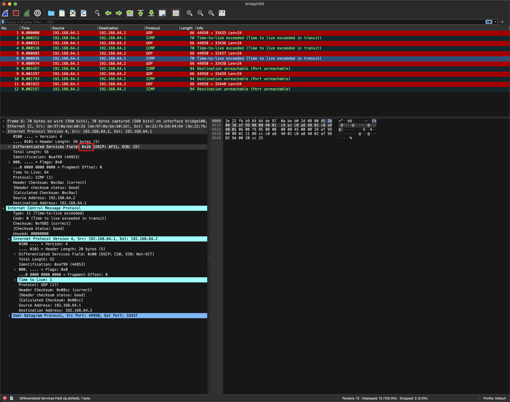

<!--
 Copyright 2023 Leon Hwang.
 SPDX-License-Identifier: MIT
-->

# XDP Traceroute

This is a simple XDP program that implements the traceroute functionality, which
can work with traceroute and mtr.

## Usage

```bash
# ./xdp-traceroute -h
Usage:
  xdp-traceroute [flags]

Flags:
      --addr string   address to traceroute, empty to retrieve from --dev
      --dev string    device to run XDP
  -h, --help          help for xdp-traceroute
```

## Example

```bash
# ./xdp-traceroute --dev enp0s1
2023/12/17 06:20:36 traceroute is running on enp0s1
```


