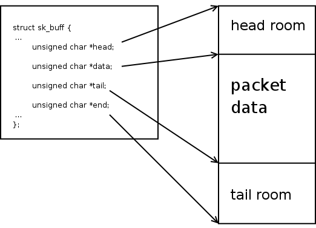

# XDP metadata 实战指南

最近需要在两个 XDP 程序之间传递一个最简单的信息，原本想着使用使用一个 bpf map 来传递。经过同事提醒，有 XDP metadata 可以用来传递简单信息，我便解锁了 XDP metadata 技术。

## 实验 demo

XDP metadata 既可以在 XDP 程序内部使用，也可以在 XDP 和 `tc-bpf` 之间使用。如下图：


1. 在 XDP 主程序里，调整 metadata，并写入一个数字。
2. 在 XDP 子程序里，取出 metadata，并检查其中的数字。
3. 在 `tc-bpf` 程序里，取出 metadata，并检查其中的数字。

使用的 XDP 程序源代码如下：

```C
#define MAGIC 0xFEDCBA98

#define ctx_ptr(ctx, mem) (void *)(unsigned long)ctx->mem

struct {
    __uint(type, BPF_MAP_TYPE_PROG_ARRAY);
    __type(key, __u32);
    __type(value, __u32);
    __uint(max_entries, 1);
} xdp_progs SEC(".maps");

SEC("xdp")
int xdp_fn(struct xdp_md *ctx)
{
    __u32 *val;

    // Note: do not bpf_xdp_adjust_meta again.

    void *data_meta = ctx_ptr(ctx, data_meta);
    void *data = ctx_ptr(ctx, data);

    val = (typeof(val))data_meta;
    if ((void *)(val + 1) > data)
        return XDP_PASS;

    if (*val == MAGIC)
        bpf_printk("xdp tailcall\n");

    return XDP_PASS;
}

SEC("xdp")
int xdp_tailcall(struct xdp_md *ctx)
{
    __u32 *val;
    const int siz = sizeof(*val);

    if (bpf_xdp_adjust_meta(ctx, -siz) != 0)
        return XDP_PASS;

    void *data_meta = ctx_ptr(ctx, data_meta);
    void *data = ctx_ptr(ctx, data);

    val = (typeof(val))data_meta;
    if ((void *)(val + 1) > data)
        return XDP_PASS;

    *val = MAGIC;
    bpf_printk("xdp metadata\n");

    bpf_tail_call_static(ctx, &xdp_progs, 0);

    return XDP_PASS;
}
```

使用的 `tc-bpf` 程序源代码如下：

```C
#define MAGIC 0xFEDCBA98

#define ctx_ptr(ctx, mem) (void *)(unsigned long)ctx->mem


SEC("tc")
int tc_metadata(struct __sk_buff *skb)
{
    void *data = ctx_ptr(skb, data);
    void *data_meta = ctx_ptr(skb, data_meta);

    __u32 *val;
    val = (typeof(val))data_meta;

    if ((void *)(val +1) > data)
        return TC_ACT_OK;

    if (*val == MAGIC)
        bpf_printk("tc metadata\n");

    return TC_ACT_OK;
}
```

实验结果如下：

```Bash
# ping server-ip from client
ip netns exec nscli ping -c1 192.168.0.11

# some bpf log
          <idle>-0       [002] d.s.1 88592.038720: bpf_trace_printk: xdp metadata
          <idle>-0       [002] d.s.1 88592.039101: bpf_trace_printk: xdp tailcall
          <idle>-0       [002] d.s.. 88592.039119: bpf_trace_printk: tc metadata
```

实验使用的环境配置脚本：[setup-veth.sh](./scripts/setup-netns.sh)。

## metadata 详解

metadata 是如何从 XDP 传递到 `tc-bpf` 的呢？

metadata 到底保存在哪里呢？

只要搞清楚 metadata 到底保存在哪里，便可知晓 metadata 是怎么从 XDP 传递到 `tc-bpf` 的。

### metadata 到底保存在哪里？

metadata 保存在 skb buffer 里。复习一下 [How SKB works](http://vger.kernel.org/~davem/skb_data.html)。



如上图，metadata 保存在 headroom 里紧挨着 packet data 的那几个字节里，下面是 `bpf_xdp_adjust_meta()` 的源代码片段：

```C
// ${KERNEL}/net/core/filter.c

BPF_CALL_2(bpf_xdp_adjust_meta, struct xdp_buff *, xdp, int, offset)
{
    void *xdp_frame_end = xdp->data_hard_start + sizeof(struct xdp_frame);
    void *meta = xdp->data_meta + offset;
    unsigned long metalen = xdp->data - meta;

    // do some check
    if (unlikely(xdp_metalen_invalid(metalen))) //  (metalen & (sizeof(__u32) - 1)) || (metalen > 32);
        return -EACCES;


    xdp->data_meta = meta;

    return 0;
}
```

> 由上面代码片段可知，一次 `bpf_xdp_adjust_meta()` 调整的 offset 不能大于 32 字节。

`struct xdp_buff` 里的 `data_meta` 指向哪里呢？

以 XDP generic 模式为例。

```C
// ${KERNEL}/net/core/dev.c

do_xdp_generic()
|-->netif_receive_generic_xdp()
    |-->bpf_prog_run_generic_xdp()
        |-->xdp_prepare_buff(xdp, hard_start, skb_headroom(skb) - mac_len, skb_headlen(skb) + mac_len, true);
            xdp_prepare_buff(struct xdp_buff *xdp, unsigned char *hard_start,
                        int headroom, int data_len, const bool meta_valid)
                {
                    unsigned char *data = hard_start + headroom;

                    xdp->data_hard_start = hard_start;
                    xdp->data = data;
                    xdp->data_end = data + data_len;
                    xdp->data_meta = meta_valid ? data : data + 1;
                }
```

由上面的代码片段可知，`struct xdp_buff` 里的 `data_meta` 指向 `data`。

因此，`bpf_xdp_adjust_meta(ctx, -4)` 就是将 `data_meta` 从 `data` 向 headroom 里挪 4 个字节，如下图。


### metadata 是如何从 XDP 传递到 `tc-bpf` 的呢？

已知在 XDP 里可以将 metadata 保存到 skb 的 headroom 里。但 `tc-bpf` 是怎么知道 headroom 里有 metadata 呢？

分两步走：XDP 和 tc 各一步。

第一步将 XDP 调整后的 metadata 大小保存到 `struct skb_shared_info` 里。

```C
// ${KERNEL}/net/core/dev.c

bpf_prog_run_generic_xdp()
{
    // ...
    act = bpf_prog_run_xdp(xdp_prog, xdp);
    // ...

    switch (act) {
    case XDP_REDIRECT:
    case XDP_TX:
        __skb_push(skb, mac_len);
        break;
    case XDP_PASS:
        metalen = xdp->data - xdp->data_meta;
        if (metalen)
            skb_metadata_set(skb, metalen);
        break;
    }

    return act;
}

// ${KERNEL}/include/linux/skbuff.h

static inline void skb_metadata_set(struct sk_buff *skb, u8 meta_len)
{
    skb_shinfo(skb)->meta_len = meta_len;
}
```

第二步，在运行 ingress `tc-bpf` 前从 `struct skb_shared_info` 里取出 metadata 的大小。

下面看下在 ingress `tc-bpf` 里是怎么拿到 metadata 的。

```C
// ${KERNEL}/net/core/dev.c

__netif_receive_skb_core()
|-->sch_handle_ingress()
    |-->tcf_classify()       // net/sched/cls_api.c
        |-->__tcf_classify()
            |-->tp->classify(skb, tp, res);
           /
          /
         /
        |-->cls_bpf_classify() // net/sched/cls_bpf.c
                if (at_ingress) {
                    /* It is safe to push/pull even if skb_shared() */
                    __skb_push(skb, skb->mac_len);
                    bpf_compute_data_pointers(skb);
                    filter_res = bpf_prog_run(prog->filter, skb);
                    __skb_pull(skb, skb->mac_len);
                } else {
                    bpf_compute_data_pointers(skb);
                    filter_res = bpf_prog_run(prog->filter, skb);
                }

                static inline void bpf_compute_data_pointers(struct sk_buff *skb) // include/linux/filter.h
                {
                    struct bpf_skb_data_end *cb = (struct bpf_skb_data_end *)skb->cb;

                    BUILD_BUG_ON(sizeof(*cb) > sizeof_field(struct sk_buff, cb));
                    cb->data_meta = skb->data - skb_metadata_len(skb);
                    cb->data_end  = skb->data + skb_headlen(skb);
                }
```

综合 XDP 和 `tc-bpf` 可知：XDP 里 `skb_metadata_set(skb, metalen);` 保存了 `metalen`，而后 `tc-bpf` 里 `skb_metadata_len(skb)` 取出 `metalen`。这一存一取之间就完成了 metadata 的传递。

## 小结

只有深入了解 XDP metadata 的技术细节，才能真正掌握 XDP metadata。
